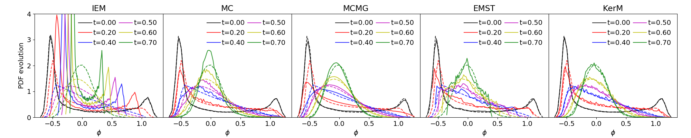

## KerM

Kernel Mixing Model for Turbulent Combustion and Transport PDF method.

This repo is for 0-D simple validation, for PaSR validation please refer to [PaSR](https://github.com/SuXY15/PaSR)

### 1. Usage

+ Fortran version:
  + [src_fortran/mixing_test.f90](src_fortran/mixing_test.f90): main program for testing.
  + [src_fortran/mixing_model_kerm.f90](src_fortran/mixing_model_kerm.f90): source code of `KerM` with differential diffusion supported.
  + [src_fortran/mixing_model_iem.f90](src_fortran/mixing_model_iem.f90): source code of `IEM`, used for comparison.
  + [src_fortran/mixing_model_mcurl.f90](src_fortran/mixing_model_mcurl.f90): source code of `MC`, used for comparison.
  + [src_fortran/mixing_model_mcmg.f90](src_fortran/mixing_model_mcmg.f90): source code of `MCMG` adopted from [^1], which implements the mapping closure mixing model used for comparison.
  + [src_fortran/emst.f](src_fortran/emst.f) and [src_fortran/emst_subs.f](src_fortran/emst_subs.f): source code of `EMST` adopted from [^2], used for comparison.
  ```shell
  # build executable file (single precision float)
  make fortran
  # run simulation, faster than cpp version
  ./mix
  # show results
  python performance.py fortran
  ```
  + Comparison results of 10k particles for EMST and MCMG; 50k particles for other models, where the dash lines are for the DNS data from [^3] (For `KerM`, sigma_k=0.25 is used)
    
  
  + Performance of mixing models
  
    
  
<details>
  <summary> C++ version </summary>

+ C++ Version:
  + [src_cpp/MixingModels.hpp](src_cpp/MixingModels.hpp): implementation of mixing models
  + [src_cpp/main.cpp](src_cpp/main.cpp): run simulation
  + [performance.py](performance.py): show results

  ```shell
  # build executable file
  make
  # run simulation, taking around 10 seconds for N=1000
  ./mix
  # show results
  python performance.py
  ```

  Comparison results of 4k particles for EMST and 100k particles for other models (`KerM` sigma_k=0.25), where the dash lines are for the DNS data from [^3]

  
  
  Performance of mixing models (`EMST-1D` do not account aging properties and no `IEM` assisted, for original `EMST` implementation, please refer to the Fortran version)
  
  

</details>

<details>
  <summary> Python version </summary>

+ Python Version:
  + [src_python/models.py](src_python/models.py): implementation of mixing models
  + [src_python/mixing_py.py](src_python/mixing_py.py): run simulation

  ```shell
  # run simulation, EMST taking around 6 seconds for N=400
  python src_python/mixing_py.py
  ```
  Comparison results of 400 particles for EMST and 50k particles for other models (only uniform weighted samples are used), where the dash lines are for the DNS data from [^3]
  
  
  
</details>

### 2. Implementations

Please refer to [TheoryGuide.pdf](TheoryGuide.pdf)

[^1]: The original MCMG implementation comes from https://tnfworkshop.org/wp-content/uploads/2019/03/MM-INTAS.zip

[^2]: The original EMST implementation comes from https://tcg.mae.cornell.edu/emst/

[^3]: A. Juneja, S.B. Pope, A DNS study of turbulent mixing of two passive scalars, Physiscs of Fluids 8 (1996) 2161.
