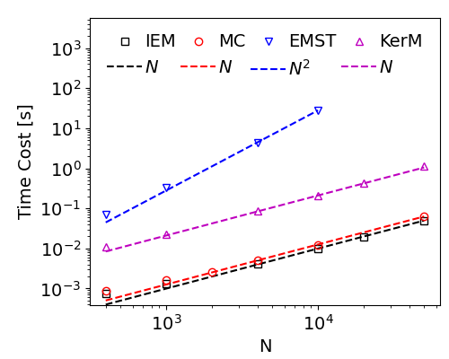

## KerM

Kernel Mixing Model for Turbulent Combustion and Transport PDF method.

This repo is for 0-D simple validation, for PaSR validation please refer to [PaSR](https://github.com/SuXY15/PaSR)

### 1. Usage

+ Python Version:
  + [src_python/models.py](src_python/models.py): implementation of mixing models
  + [src_python/mixing_py.py](src_python/mixing_py.py): run simulation

  ```shell
  # run simulation, taking around 10 minute for N=1000
  python src_python/mixing_py.py
  ```

  Comparison results of 1k particles for EMST and 10k particles for other models (uniform weighted samples, KerM sigma_k=0.3)
  
  

+ C++ Version:
  + [src_c/MixingModels.hpp](src_c/MixingModels.hpp): implementation of mixing models
  + [src_c/main.cpp](src_c/main.cpp): run simulation
  + [performance_c.py](performance_c.py): show results

  ```shell
  # build executable file
  make 
  # run simulation, taking around 10 secdons for N=1000
  ./mix
  # show results
  python performance_c.py
  ```

  Comparison results of 4k particles for EMST and 100k particles for other models (KerM sigma_k=0.25)

  
  
  Performance of mixing models
  
  
  

+ Fortran version:

  + [src_fortran/kernel_mixing_model.f90](src_fortran/kernel_mixing_model.f90): source code with differential diffusion supported version, not fully tested yet.

    

### 2. Implementations

Please refer to [TheoryGuide.pdf](TheoryGuide.pdf)

